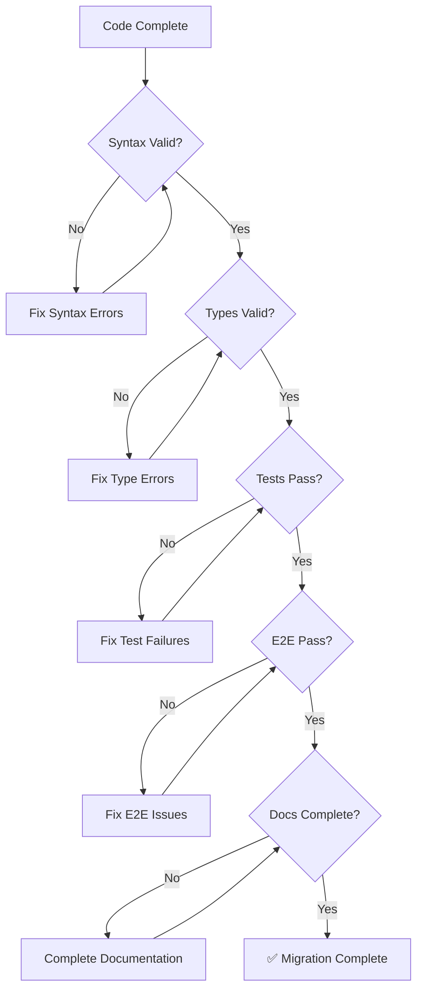

# Conductor to Temporal: Quality Assurance

> **Part of the [Conductor to Temporal Migration Guide](./CONDUCTOR_TO_TEMPORAL.md)**

This document defines the quality standards, validation procedures, and success criteria for Conductor to Temporal migrations.

---

## Validation and Testing

### Syntax Validation
```bash
python3 -m py_compile {project_name}/*.py
```
All files must compile without errors.

### Type Checking
```bash
mypy {project_name} --strict --ignore-missing-imports
```
Must pass with no type errors.

### Unit Tests
```bash
cd {project_name}
pytest -v
```
All tests must pass.

### Integration Test (End-to-End)
```bash
# Terminal 1: Start Temporal dev server
temporal server start-dev

# Terminal 2: Start worker
uv run worker.py

# Terminal 3: Execute workflow
uv run starter.py

# Verify in Temporal Web UI
open http://localhost:8233
```

### Verification Checklist
- [ ] All Python files compile without syntax errors
- [ ] mypy --strict passes with no errors
- [ ] All unit tests pass
- [ ] Worker starts successfully and polls task queue
- [ ] Workflow executes and completes successfully
- [ ] Workflow result matches expectations
- [ ] No errors in Temporal Web UI execution history

---

## Migration Success Criteria

### Required Outcomes
✅ **Complete project structure** generated with all files

✅ **Syntax validation** passes for all Python files

✅ **Type checking** passes with mypy --strict

✅ **Unit tests** pass with good coverage

✅ **End-to-end execution** succeeds against Temporal dev server

✅ **Documentation** complete with setup and usage instructions

✅ **Code quality** follows Python best practices and PEP 8

### Quality Standards
- Type hints on all functions (strict mode)
- Comprehensive docstrings
- Proper error handling
- Appropriate timeouts and retry policies
- Clean separation of concerns (activities, workflows, data)

### Deliverables Checklist
- [ ] Working Temporal Python project
- [ ] All activities implemented
- [ ] Workflow logic correctly translated
- [ ] Worker and starter scripts functional
- [ ] Comprehensive test suite
- [ ] Complete documentation (README, comparison, migration notes)
- [ ] Setup script for easy installation
- [ ] Migration summary report

---

## Code Quality Standards

### Python Best Practices

1. **Type Hints (Strict Mode)**
   ```python
   # ✓ CORRECT
   async def process_data(input: str, timeout: int = 30) -> Dict[str, Any]:
       ...

   # ❌ WRONG - Missing type hints
   async def process_data(input, timeout=30):
       ...
   ```

2. **Comprehensive Docstrings**
   ```python
   # ✓ CORRECT
   @activity.defn
   async def fetch_user(user_id: str) -> Dict[str, Any]:
       """
       Fetch user data from the API.

       Args:
           user_id: Unique identifier for the user

       Returns:
           Dict containing user data including name, email, and status

       Raises:
           ValueError: If user_id is invalid
           RuntimeError: If API request fails
       """
       ...
   ```

3. **Error Handling**
   ```python
   # ✓ CORRECT - Specific exception handling
   try:
       response = await client.get(url)
       response.raise_for_status()
   except httpx.HTTPStatusError as e:
       activity.logger.error(f"HTTP error: {e}")
       raise
   except httpx.RequestError as e:
       activity.logger.error(f"Request failed: {e}")
       raise
   ```

4. **Appropriate Timeouts**
   ```python
   # ✓ CORRECT - Reasonable timeout for activity type
   result = await workflow.execute_activity(
       fetch_data,
       args=[url],
       start_to_close_timeout=timedelta(seconds=30),  # Quick API call
       retry_policy=RetryPolicy(maximum_attempts=3)
   )

   # For long-running tasks
   result = await workflow.execute_activity(
       process_large_file,
       args=[file_path],
       start_to_close_timeout=timedelta(minutes=10),  # Long processing
       heartbeat_timeout=timedelta(seconds=30)  # Regular heartbeats
   )
   ```

5. **Clean Separation of Concerns**
   - **shared.py**: Only data models (dataclasses)
   - **activities.py**: Only activity implementations (no workflow code)
   - **workflow.py**: Only workflow logic (no activity implementations)
   - **worker.py**: Only worker registration (no business logic)
   - **starter.py**: Only workflow execution (no business logic)

---

## Testing Standards

### Activity Test Coverage

Each activity must have:
- ✅ Happy path test (successful execution)
- ✅ Error handling test (exception cases)
- ✅ Input validation test (invalid inputs)

```python
@pytest.mark.asyncio
async def test_fetch_user_success():
    """Test successful user fetch."""
    result = await fetch_user(user_id="123")
    assert result["name"] == "John Doe"

@pytest.mark.asyncio
async def test_fetch_user_not_found():
    """Test user not found error."""
    with pytest.raises(ValueError):
        await fetch_user(user_id="invalid")
```

### Workflow Test Coverage

Each workflow must have:
- ✅ Happy path test (normal execution flow)
- ✅ Conditional branch tests (each SWITCH case)
- ✅ Loop behavior tests (entry/exit conditions)
- ✅ Error handling tests (activity failures)

```python
@pytest.mark.asyncio
async def test_workflow_approved_path():
    """Test workflow when approval is granted."""
    env = await WorkflowEnvironment.start_time_skipping()
    async with Worker(env.client, task_queue="test", workflows=[ApprovalWorkflow], activities=[...]):
        result = await env.client.execute_workflow(
            ApprovalWorkflow.run,
            WorkflowInput(status="APPROVED"),
            id="test-approved",
            task_queue="test"
        )
        assert result.outcome == "success"
```

### Integration Test Requirements

- ✅ Full workflow execution against test environment
- ✅ All activities execute successfully
- ✅ Data flows correctly between tasks
- ✅ Final result matches expected output

---

## Performance Standards

### Response Time Targets

| Component | Target | Maximum |
|-----------|--------|---------|
| Activity startup | < 100ms | 500ms |
| Simple activity execution | < 1s | 5s |
| HTTP activity execution | < 3s | 30s |
| Workflow startup | < 200ms | 1s |
| Workflow execution (simple) | < 10s | 60s |

### Resource Usage Limits

- Worker memory: < 512MB baseline
- Activity concurrency: 5-10 parallel executions
- Database connections: Pool size 5-10
- HTTP client connections: Pool size 10-20

---

## Documentation Standards

### Required Documentation

1. **README.md**
   - ✅ Project overview
   - ✅ Prerequisites
   - ✅ Setup instructions
   - ✅ Running instructions
   - ✅ Testing instructions
   - ✅ Troubleshooting section

2. **CONDUCTOR_COMPARISON.md**
   - ✅ Side-by-side Conductor vs Temporal examples
   - ✅ Task type mappings from actual workflow
   - ✅ Control flow translations
   - ✅ Data passing examples

3. **CONDUCTOR_MIGRATION_NOTES.md**
   - ✅ Migration-specific decisions
   - ✅ Assumptions made
   - ✅ Manual steps required
   - ✅ Known limitations

4. **Code Comments**
   - ✅ Complex logic explained
   - ✅ Original Conductor task names referenced
   - ✅ Data transformations documented
   - ✅ Timeout/retry rationale explained

---

## Continuous Validation

### Pre-Commit Checks

```bash
# Run before each commit
python3 -m py_compile {project_name}/*.py  # Syntax
mypy {project_name} --strict                # Types
pytest -v                                    # Tests
```

### CI/CD Pipeline Checks

1. **Linting**: ruff or flake8
2. **Type checking**: mypy --strict
3. **Unit tests**: pytest with coverage > 80%
4. **Integration tests**: E2E workflow execution
5. **Security scan**: bandit or similar
6. **Dependency check**: pip-audit or safety

---

## Quality Gates

A migration must pass ALL quality gates before being considered complete:

### Gate 1: Code Quality
- ✅ All files pass syntax validation
- ✅ mypy --strict passes with zero errors
- ✅ No code smells (duplicate code, long functions, etc.)
- ✅ Follows PEP 8 style guide

### Gate 2: Testing
- ✅ All unit tests pass
- ✅ Test coverage > 80%
- ✅ All critical paths tested
- ✅ E2E test passes

### Gate 3: Documentation
- ✅ README complete and accurate
- ✅ All code has docstrings
- ✅ Migration notes documented
- ✅ Troubleshooting guide included

### Gate 4: Functionality
- ✅ Workflow executes successfully
- ✅ All activities complete without errors
- ✅ Results match expected behavior
- ✅ No errors in Temporal UI

### Gate 5: Production Readiness
- ✅ Error handling implemented
- ✅ Timeouts configured appropriately
- ✅ Retry policies defined
- ✅ Logging configured
- ✅ Monitoring hooks added (optional)

---

## Quality Assurance Workflow



---

## Related Documentation

- [Architecture Guide](./conductor-architecture.md) - Conductor vs Temporal concepts
- [Migration Guide](./conductor-migration-guide.md) - Step-by-step instructions
- [Troubleshooting](./conductor-troubleshooting.md) - Common issues and solutions

---

**[← Back to Main Guide](./CONDUCTOR_TO_TEMPORAL.md)**
